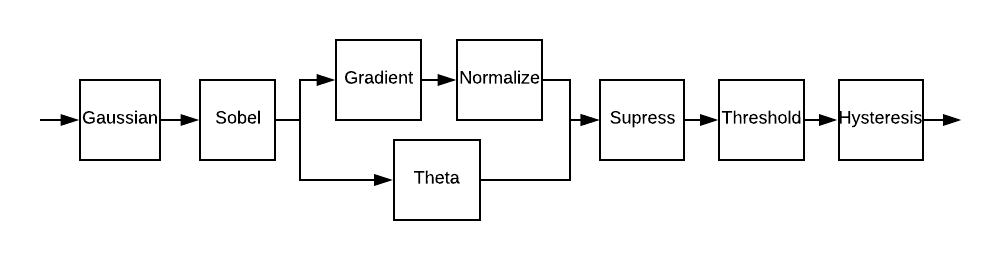

# CannyVHDL
#### This work has been published and is open access:
Douglas A. Santos, Daniel Zolett, Mateus Belli, Felipe Viel, and Cesar A. Zeferino. "An Analysis of the Implementation of Edge Detection Operators in FPGA." In Anais Estendidos do X Simpósio Brasileiro de Engenharia de Sistemas Computacionais, pp. 163-167. SBC, 2020. [https://doi.org/10.5753/sbesc_estendido.2020.13107](https://doi.org/10.5753/sbesc_estendido.2020.13107)

A implementação do algoritmo será feita utilizando valores de ponto fixo com sinal de 32 bits, sendo 22 bits fracionários.

# Instruções

## Organização das Pastas

As pastas são separadas de acordo com o propósito dos arquivos, sendo assim:

- **dat**: arquivos de dados com extensão *.dat* utilizados em simulações ou testes

- **hdl**: códigos em liguagem de descrição de hardware, são aceitas as linguagens VHDL (*.vhd*), Verilog (*.v*) e SystemVerilog (*.sv*)

- **sim**: simulações do modelsim, são aceitos os códigos em VHDL (*.vhd*) e configuração de formas de onda (*.wcfg*)

- **intel**: arquivos de projeto do Quartus (*.qpf*), configurações do projeto do Quartus (*.qsf*) e arquivos de IPs (*.qip*)

- **script**: scripts em TCL (*.tcl*), Python (*.py*), Bash (*.sh*), e DO (*.do*)

- **src**: códigos nas linguagens C e C++, são aceitos os arquivos com extensão *.c*, *.h* e *.cpp*

## Branches

Cada pessoa deve utilizar uma branch com o **próprio** nome, para evitar conflitos de código.

Assim que o bloco estiver pronto e validado, o desenvolvedor deve realizar um pull request para a branch **release**, que será aprovado pelos outros colaboradores.

Só serão realizados merges com a branch **master** quando o sistema inteiro estiver validado.

## Códigos VHDL

Todos os códigos devem utilizar o tipo ponto fixo com sinal, a biblioteca de ponto fixo deve ser incluida em todos os códigos e está na pasta **hdl/sfixed**.

Para melhorar a organização dos códigos HDL, cada etapa do algoritmo estará em uma pasta diferente.

Cada pasta deve estar composta pelos arquivos **top**, **control**, **datapath** e **package**

Obs.: No caso de não haver controle haverá apenas os arquivos **top** e **package**

Os nomes dos arquivos devem seguir o padrão: [nome da etapa]\_[top | ctrl | dp | pkg].vhd

Divisão das pastas:
- **hdl/gaussian** e **sim/gaussian**
- **hdl/gradient** e **sim/gradient**
- **hdl/hysteresis** e **sim/hysteresis**
- **hdl/normalize** e **sim/normalize**
- **hdl/sobel** e **sim/sobel**
- **hdl/supress** e **sim/supress**
- **hdl/theta** e **sim/theta**
- **hdl/threshold** e **sim/threshold**

